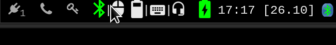

<p align="center">
Fork of the Polybar project - a fast and easy-to-use tool for creating status bars.
</p>

**Multibar** is a fork of an existing project named Polybar and aims to help users build beautiful and highly customizable status bars
for their desktop environment, without the need of having a black belt in shell scripting.

I created this fork primarily for my personal usage as I have several improvements over the "vanilla" version and I wanted to make this maintainable.
I have changed the name since I want both this and Polybar to be installed simultaneously on my system and "_polybar2_" seemed too lame...


My intention is to keep as much compatibility with Polybar and point out things that are different. You can use Polybar Wiki for most of the things here.

## Table of Contents

* [Introduction](#introduction)
* [Improvements over Polybar](#improvements-over-polybar)
  * [Hover actions](#hover-actions)
  * [Enhanced `internal/backlight`](#enhanced-internalbacklight)
  * [Enhanced `internal/network`](#enhanced-internalnetwork)
  * [Enhanced `internal/battery`](#enhanced-internalbattery)
* [Getting started](#getting-started)
  * [Installation](#installation)
  * [First Steps](#first-steps)
* [License](#license)
* [Signatures](#signatures)

## Introduction

The main purpose of **Multibar** is to help users create awesome status bars.
It has built-in functionality to display information about the most commonly used services.
Some of the services included so far:

- Systray icons
- Window title
- Playback controls and status display for [MPD](https://www.musicpd.org/) using [libmpdclient](https://www.musicpd.org/libs/libmpdclient/)
- [ALSA](https://www.alsa-project.org/main/index.php/Main_Page) and [PulseAudio](https://www.freedesktop.org/wiki/Software/PulseAudio/) volume controls
- Workspace and desktop panel for [bspwm](https://github.com/baskerville/bspwm) and [i3](https://github.com/i3/i3)
- Workspace module for [EWMH compliant](https://specifications.freedesktop.org/wm-spec/wm-spec-1.3.html#idm140130320786080) window managers
- Keyboard layout and indicator status
- CPU and memory load indicator
- Battery display
- Network connection details
- Backlight level
- Date and time label
- Time-based shell script execution
- Command output tailing
- User-defined menu tree
- Inter-process messaging
- And more...

[See the Polybar wiki for more details](https://github.com/polybar/polybar/wiki).

## Improvements over Polybar

### Hover actions
- Modules are now easily upgradeable (with backwards compatibility) to use new hover actions (A9 A10).
- There is `format` and `format-hover` that is evaluated when mouse is hovering over a module

#### Example usage with `internal/date`:
```ini
[module/date]
type = internal/date
interval = 2
date = [%d.%m]
time = %H:%M
date-alt = [%d.%m.%Y]
time-alt = %H:%M:%S
label = %{A9:#date.toggle:}%{A10:#date.toggle:}%time% %date%%{A9 A10}
```
results in following change when hovering over date module:



#### Example with `internal-backlight`:
```ini
[module/brightness]
type = internal/backlight
card = intel_backlight

enable-scroll = true
scroll-log = true
reverse-scroll = true
scroll-interval = 10

format = "%{T5}%{T-}<label>%{F-}  "
label =
label-hover = " %percentage%%"
```
results in following change when hovering over date module:


### Enhanced `internal/backlight`
This module got several new options:
- `reverse-scroll` (default off), this one is pretty self-explanatory
- `logarithmic-scroll` (default off). This changes `scroll-interval` dynamically - basically human eye is a lot more sensitive to
changes in backlight in the lower range. Meaning that perceived change from 85%->100% is basically the same as for example 1%->3%.
This option sets `scroll-interval` to 1% when brightness <5% and to 3% when brightness is <= 15%, allowing much smoother dimming
while still enabling reasonable fast scrolling for higher brightness.

### Enhanced `internal/network`
Network module got an `metric-units` option as described in [Polybar PR #3001 by @Cationiz3r](https://github.com/polybar/polybar/pull/3001)
There is also new token `%local_netmask%` that can be used to determine netmask - nice feature for someone who works with a lot of
networking.

I also added TAG `<default-gw-mark>` that gets replaced with string specified by `default-gw-mark` setting (defaults to `+`) when modules
interface is a default gw.

This module now also has all the `click-` actions, so you don't have to specify `%{A...}` for each and every label anymore.

### Enhanced `internal/battery`
This module got extra `ramp-charging` option as I like to have a special icon when charging (has a bolt inside).

Also, my laptop (DELL Precision 7760) has a feature that allows me to limit battery charge "off-hours" - so when my battery
reaches 90%, it will stop charging. Old implementation of Polybar saw this "idle" state as "discharging" with 00:00 time and quite
did not like that! I like to have orange color when discharging, so it was extra obvious that the original behavior was
not quite right. I also did not want to use `full-at` since it would be just wrong - the battery will charge up to 100%, just not
during the off-hours.

### TODO
- [ ] Global hover actions in modules - at least the ones I use ;-)
- [ ] Support for adding icons to workplace names in i3 based on what app is on workplace
- [ ] Network aliases for `internal/network` modules, so I can have home SSID displayed as  etc
- [ ] Add ICMP module, so we can monitor the internet connection (not tied to any network module)
- [ ] Sending DBUS notification on volume/brightness change
- [ ] `internal/pulseaudio` should support both sources and sinks
- [X] Mark default-gw interface in `internal/network` so I can tell what is being used as uplink


## Getting started

### Installation
If you are using **Gentoo**, you can use [my overlay](https://github.com/xoores/gentoo-overlay) that will have necessary ebuilds.

Otherwise, you will have to [build from source](https://github.com/polybar/polybar/wiki/Compiling).

### First Steps
[See the Polybar wiki for details on how to run and configure multibar](https://github.com/polybar/polybar/wiki).

## License

Both Multibar and Polybar is licensed under the MIT license. [See LICENSE for more information](https://github.com/xoores/multibar/blob/master/LICENSE).

## Signatures

All commits are signed by my GPG key.